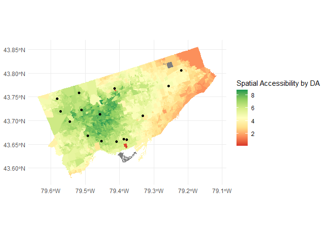

<!-- README.md is generated from README.Rmd. Please edit that file -->

# Evaluating Effects of Population Demographics on Access to Sexual Health Care: A Toronto Case Study

<!-- badges: start -->
<!-- badges: end -->

Audreana Rossi (400325255)  
Moira Chantelle Lobo (400242471)  
Eva Boomsma (400325609)  
Heléna Muirhead-Hunt (400170333)  
Eva Novoselac (400314401)  
Samantha Kirtz (400332730)  
Peri Juskiw (400264473)  
Samantha Victoria Baginski (400268593)

Final project for **ENVSOCTY 4GA3** [Applied Spatial
Statistics](https://academiccalendars.romcmaster.ca/preview_course_nopop.php?catoid=53&coid=267722)
(McMaster University)

## Abstract

This report examines the accessibility to sexual health clinics operated
by the City of Toronto, and the correlation of this variable with the
spatial distribution of various disadvantaged populations.

# Introduction

Access to sexual health care services is a critical component of public
health initiatives, fostering the welfare of individuals within
communities. However, in Toronto, Canada, as in many urban centres
worldwide, equitable access to such services remains elusive for certain
demographic groups. The City of Toronto promotes its Sexual Health
Clinic Program following the Ontario Ministry of Health services
guidelines, providing various services to sexually active individuals
(City of Toronto, n.d.). According to the City of Toronto’s Sexual
Health Clinics website, the Sexual Health Clinic program aims to serve
those, regardless of age, experiencing barriers to accessing effective
sexual health services, including: people with concerns about a sexually
transmitted infection and their partners, recent immigrants or refugees,
people who share a disproportionate burden of HIV/STIs, people who need
access to low cost birth control, people who are part of the 2SLGBTQ
community, and people involved in sex work. It is important for the city
to recognize these marginalised groups, but also to adequately serve the
communities. Accessibility to sexual healthcare in Toronto should
therefore reflect efforts to accommodate these vulnerable groups.

This primilar demographic disparities in access to sexual health clinics
have been documented outside of Toronto in multiple global and
international case studies, contributing to the issue of unequal access
of sexual health care (Shah & Wilson, 2016; Olsen et al., 2012). Despite
this, the majority of the literature explores demographic effects on
accessing general health care, as opposed to specifically exploring
access to sexual health care. Additionally, any research like that of
Wang et al. (2022) focusing especially on sexual health care, is out of
date, and reflects a pre-pandemic picture of access to care that may be
drastically different today. These gaps in research highlight the
necessity of our project in investigating how demographic factors affect
Torontonians access to sexual health care today.

As outlined, there is a great need for research in access to as well as
the development of sexual health care internationally, but especially in
urban centres and at a neighbourhood level (Shah et al., 2016). It is
important to assess this issue using region-specific strategies, as
healthcare is not a “one size fits all” service (Weiner, 2010).

# Data & Methods

The area selected for this project was the census subdivision (CSD) of
Toronto. The primary data being used in our analysis includes the point
data of fifteen sexual health clinic locations in Toronto, as well as
spatial demographic and social demographic data at the dissemination
area level (Figure 1). Before analysis in the R Studio software, both
the Toronto sexual health clinic data (Toronto Public Health, 2024) and
the Canadian census data (Statistics Canada, 2021) had to be prepared
for use. Additionally, a shapefile of Toronto was extracted for
calculated accessibility to clinics to be mapped onto (Statistics
Canada, 2021).

<!-- -->

## Clinic Data

The sexual health clinic dataset is from the Toronto Open Data Portal,
published by Toronto Public Health. The dataset is from August 15, 2019,
with the last refresh being January 14, 2024. The Toronto sexual health
clinic data, including fifteen locations operated by Toronto Public
Health, was downloaded in .xslx format. This data set only indicated the
location of the clinics using addresses, thus coordinates had to be
incorporated to the table. Using the ‘Awesome Table’ extension from
Google Sheets, the latitude and longitude coordinates were generated in
two separate columns using the address as an input. This allowed each
location to obtain point geometry and be loaded into RStudio for further
analysis. <!-- -->

## Census Data

The census data was accessed through MountainMath Analytics website,
which hosted a comprehensive viewer of Statistics Canada data from the
2021 census. The data was chosen to be extracted at the dissemination
area (DA) level within the Toronto Census subdivision, within the
metropolitan area (CMA) of the Greater Toronto District. Data was
selected at the DA level because it was the smallest available census
unit, meaning it best represented the census data at a population level.
To load Canadian census data in R Studio it required use of an API key.
This key was obtained from the Canadian Census Analyser, hosted by the
University of Toronto. The API key was granted through the students’
McMaster login credentials. The cache path was then set, using the
‘set_cancensus_cache_path’ package, linking the census data to this
location on the device. The ‘can_census’ function was then utilised in R
Studio to extract census data of interest at the DA level:

-Population -Income -Gender -Age -Visible Minority Population
-Indigenous Population -Single Parent Population

Census data by DA was extracted as a simple feature class data frame,
and table variables were renamed for ease of use. The census data
variables of interest, listed above, were then loaded as columns into
the Toronto census data frame from the created cache location. Some
variables were manipulated for further use in the analysis, including
creating a variable for total proportion of female population in each
dissemination area, obtained by dividing the total female population by
the total census area population. A variable for the population aged 15
and above was also created by adding the counts of the population aged
15 to 64 and the population 65 and above. This was done because there is
increased demand for access to sexual health clinics in this age group,
compared to the rest of the population.

## Plotting the Census Data

Using the ‘ggplot()’ function, the census data of interest was plotted
in the study area as choropleth maps, showcasing the different variable
values for each dissemination area. These maps allowed for a simplistic
visual understanding of the distribution of a variety of population
demographics. These were combined for easy side by side comparisons of
trends compared to sexual health clinic locations.

## Creating the Table for Accessibility Analysis

The centroids of each of these dissemination areas was first determined
using the ‘st_centroid’ function, applied to the Toronto shapefile.
These points within the study area were created to determine the
accessibility score of each census tract area, in later steps. They
define the locations or origins of demand for sexual health care, where
areas cannot be used. The function ‘st_distance’ was then used to
calculate the Euclidean distances from each dissemination area centroid
to each clinic in a matrix. We then converted it to a binary distance
list, with a column for the origin (DAUID), destination (clinic 1-15)
and paired distances in metres. To obtain travel time, distances were
converted from metres to kilometres by dividing by 1000, and then
converted to travel time by dividing by 40. A general travel time of 40
kilometres per hour was assumed, considering the urban study area.
Stepwise impedance was calculated using a ‘case_when’ function using
methods demonstrated by Paez et al. (2019). Impedance was given in
minutes, thus was converted back to minutes by multiplying by 60. The
function, courtesy of Paez et al. (2019) is listed below. $$
f(t_{ij}) = \left\{
  \begin{array}{ll}
    0.946 & t_{ij} \le 5\\ 
    0.801 & 5 \le t_{ij} 10\\
    0.607 & 10 \le t_{ij} 15\\
    0.411 & 15 \le t_{ij} 20\\
    0.135 & 20 \le t_{ij} 30\\
    0.011 & 30 \le t_{ij} 45\\
    0.000 & 45 < t_{ij}
  \end{array}
\right.
$$ These impedance values for all DAs to each clinic were then summed,
creating the total weighted sum of impedance for each DA. This data
frame, including the summed impedance value, was then appended to the
census data of interest via ‘left join.’ Similar methodology was
performed by Dr. Paez, but with the use of network distance. This
allowed for a more realistic view on spatial accessibility, which
defined our main point of reference for analysing spatial accessibility
to sexual health clinics. These accessibility scores were then mapped
for visualisation and analysation purposes, and accessibility score was
then used in each of the analyses indicated below. A Moran’s I test and
map were used to identify patterns in the data. We also attempt to
determine a relationship of statistical significance between the census
data and accessibility data using regression analysis.

# Results & Analysis

Accessibility is defined in our analysis by the travel time in minutes.
The closer the DA centroid is to the clinics, the more accessible it is
for those populations. The clinics located in the dissemination areas
defined in Toronto (Figure 1) were compared to census data of median
income, proportion of female population, indigenous population,
single-parent population, and visible minority to draw a conclusion to
the question “How does accessibility to sexual health care clinics
differ across social demographics in Toronto?”

Figure 2 displays the Moran’s I plot of clinic accessibility by
dissemination area and the spatial autocorrelation present. As per the
Moran’s I test results, the Moran’s I statistic is 9.311670e-01. This
positive and relatively high value suggests that a non-random spatial
pattern is present of similar values. The output is summarised in table
1, and this result is confirmed with the points and slope of the plot
seen in Figure 2. The points on the plot are situated near the steep
line suggesting a correlation being present for the clinic accessibility
by dissemination area as well as less randomness being present in these
results. Additionally, with the p-value being such a small value at \<
2.2e-16 we are able to reject the null hypothesis with a high degree of
confidence as the small p-value correlates to a strong pattern being
displayed.

    #> 
    #>  Moran I test under randomisation
    #> 
    #> data:  toronto_das_clean$acc_sex  
    #> weights: toronto_das_clean.w    
    #> 
    #> Moran I statistic standard deviate = 99.041, p-value < 2.2e-16
    #> alternative hypothesis: greater
    #> sample estimates:
    #> Moran I statistic       Expectation          Variance 
    #>      9.314249e-01     -2.680247e-04      8.849435e-05

<!-- --><!-- -->

Figure 3 can be used to visually compare trends in demographic variables
where sexual health clinics are present. As shown in 3A, it appears that
high median income coincides with areas where you can expect a sexual
health clinic. 3B suggests that there is more accessibility to clinics
for households of single parents, which is indicated by the darker hues
near the clinics. On the other hand, the data for Indigenous population
and visible minorities vs. clinic locations are a bit more
unpredictable. Overall, the plot of Indigenous population and
accessibility shows there is more accessibility to clinics in areas of
high Indigenous population (Figure 3C). A similar pattern is seen for
accessibility and visible minorities. Where there is a large population
of visible minorities, there is more accessibility to clinics (Figure
3D). From a visual observation, it appears that little to no randomness
is present in the demographics. In relation to the sexual health
clinics, these observations suggest a potential correlation with
accessibility, prompting further analysis.


Figure 4 shows the location of clinics and scale of accessibility, as a
function of stepwise impedance, for each clinic. Accessibility is higher
in more central parts of the city, since they can reach more clinics at
a lower cost due to less travel time and easier access compared to
people who live on the outskirts. Another reason could be due to a
higher population in the centre which would mean the need for more
clinics. This map can be compared to Figure 3A which shows the median
income census data. There is some clustering present in central Toronto
as well as towards the south-west of the map which means that high
median income households have more accessibility to sexual health
clinics than low income areas.
<!-- -->

Before being able to statistically determine a relationship in
accessibility and census covariates, the pattern of accessibility must
first be tested for randomness. If this pattern is determined to be
non-random, then the regression model can be used to provide more
insight into the relationships between these variables. To test the
spatial randomness of the accessibility for each DA, a local Moran’s I
analysis was calculated. This is a spatial coefficient that helps
determine spatial autocorrelation, and tests the null hypothesis that
evaluates the data values for spatial randomness. The null hypothesis
for this test is that the spatial pattern is spatially random.

For this dataset, the Moran’s I statistic is 9.31167e-01 and the p-value
of the test is 2.2e-16. As the p-value of this analysis is notably less
than 0.05, it can be determined that it is statistically significant and
the null hypothesis can be rejected with high confidence. This means
that the accessibility to the sexual health clinics in Toronto, Ontario
is spatially autocorrelated. As illustrated in Figure 5, a local Moran’s
I map highlights where low accessibility values are typically with other
low accessibility values, and high accessibility values are typically
with other high accessibility values.
<!-- -->

``` r
knitr::include_graphics("figures/lmp.pop15plus.png")
```

<!-- -->

Knowing that accessibility to sexual health clinics in Toronto has a
non-spatially random pattern, the next step is to determine the process
that creates this non-random pattern. Regression analysis can be used to
determine the relationships between the census variables and
accessibility. Looking at table 2 below, the collinearity for the
independent variables show that indigenous and minority population
pairing is extremely collinear to analyse and draw accurate conclusions.
Similarly, the collinear values for one parent families and visible
minorities, and one parent families and indigenous population, are close
to 1 which makes us less confident in the comparison of these factors.

    #> 
    #>  Pearson's product-moment correlation
    #> 
    #> data:  toronto_das$Median_Income and toronto_das$Visible_Minority_Pop
    #> t = -2.8965, df = 3673, p-value = 0.003796
    #> alternative hypothesis: true correlation is not equal to 0
    #> 95 percent confidence interval:
    #>  -0.07994712 -0.01542843
    #> sample estimates:
    #>         cor 
    #> -0.04773757
    #> 
    #>  Pearson's product-moment correlation
    #> 
    #> data:  toronto_das$Median_Income and toronto_das$Indigenous_Pop
    #> t = -2.8997, df = 3673, p-value = 0.003758
    #> alternative hypothesis: true correlation is not equal to 0
    #> 95 percent confidence interval:
    #>  -0.08000011 -0.01548175
    #> sample estimates:
    #>         cor 
    #> -0.04779078
    #> 
    #>  Pearson's product-moment correlation
    #> 
    #> data:  toronto_das$Median_Income and toronto_das$One_Parent_Families
    #> t = -19.455, df = 3673, p-value < 2.2e-16
    #> alternative hypothesis: true correlation is not equal to 0
    #> 95 percent confidence interval:
    #>  -0.3346704 -0.2760398
    #> sample estimates:
    #>        cor 
    #> -0.3056448
    #> 
    #>  Pearson's product-moment correlation
    #> 
    #> data:  toronto_das$Indigenous_Pop and toronto_das$Visible_Minority_Pop
    #> t = 29144, df = 3725, p-value < 2.2e-16
    #> alternative hypothesis: true correlation is not equal to 0
    #> 95 percent confidence interval:
    #>  0.9999977 0.9999979
    #> sample estimates:
    #>       cor 
    #> 0.9999978
    #> 
    #>  Pearson's product-moment correlation
    #> 
    #> data:  toronto_das$One_Parent_Families and toronto_das$Visible_Minority_Pop
    #> t = 71.907, df = 3725, p-value < 2.2e-16
    #> alternative hypothesis: true correlation is not equal to 0
    #> 95 percent confidence interval:
    #>  0.7486204 0.7755253
    #> sample estimates:
    #>       cor 
    #> 0.7624021
    #> 
    #>  Pearson's product-moment correlation
    #> 
    #> data:  toronto_das$One_Parent_Families and toronto_das$Indigenous_Pop
    #> t = 71.916, df = 3725, p-value < 2.2e-16
    #> alternative hypothesis: true correlation is not equal to 0
    #> 95 percent confidence interval:
    #>  0.7486614 0.7755625
    #> sample estimates:
    #>       cor 
    #> 0.7624412

Since we found that the Indigenous population and visible minority
population statistics were highly correlated (collinear), the decision
was made to only use one of these variables for the sake of reducing
redundancy. We opted to use the visible minority population because the
variable was more generalised and encompassed more representation. Using
a multivariate linear regression model, the following output was
produced:

    #> 
    #> Call:
    #> lm(formula = acc_sex ~ Median_Income + Visible_Minority_Pop + 
    #>     One_Parent_Families, data = st_drop_geometry(toronto_das_clean))
    #> 
    #> Residuals:
    #>     Min      1Q  Median      3Q     Max 
    #> -5.6240 -1.1910  0.1018  1.1717  3.5870 
    #> 
    #> Coefficients:
    #>                        Estimate Std. Error t value Pr(>|t|)    
    #> (Intercept)           4.472e+00  1.040e-01  43.011  < 2e-16 ***
    #> Median_Income         2.253e-05  2.167e-06  10.395  < 2e-16 ***
    #> Visible_Minority_Pop -2.251e-04  6.588e-05  -3.417 0.000641 ***
    #> One_Parent_Families   2.802e-03  9.763e-04   2.870 0.004127 ** 
    #> ---
    #> Signif. codes:  0 '***' 0.001 '**' 0.01 '*' 0.05 '.' 0.1 ' ' 1
    #> 
    #> Residual standard error: 1.595 on 3669 degrees of freedom
    #> Multiple R-squared:  0.0307, Adjusted R-squared:  0.0299 
    #> F-statistic: 38.73 on 3 and 3669 DF,  p-value: < 2.2e-16

These results indicate that the relationships between sexual health
clinics and median income, visible minority population, and one-parent
families are statistically significant. This is proven by the sub 0.05
p-values. These findings coincide with the trends observed in Figure
3:A-D. The next step in the regression analysis was to assess the
residual values. These values should indicate randomness in order for
the regression model to be well-fitted to our data analysis. The outcome
(Figure 5) appeared to be spatially non-random.
<!-- -->

Figure 6 shows a clear clustering towards the downtown area, indicating
non-randomness. To further test this correlation, we looked at the
statistics for the Moran’s I test on the residual values:

    #> 
    #>  Moran I test under randomisation
    #> 
    #> data:  toronto_das_clean$predictormodel.e  
    #> weights: regressionclean.w    
    #> 
    #> Moran I statistic standard deviate = 96.113, p-value < 2.2e-16
    #> alternative hypothesis: greater
    #> sample estimates:
    #> Moran I statistic       Expectation          Variance 
    #>      9.157609e-01     -2.723312e-04      9.083546e-05

The statistical results confirm the residuals are not spatially random
shown by the p-value significantly lower than 0.05. In order for a
successful linear regression model, the p-values should be high,
indicating randomness as spatial autocorrelation can be problematic for
linear regression analysis. Randomness in residuals is important for
successful linear regression as it indicates that the relationships
between independent and dependent variables have been captured by the
model. The non-randomness of residuals in this case is likely due to
linear regression assumptions not being met, ultimately meaning our
attempt to create a linear regression model failed. Another alternative
to linear regression is creating a model using logistic regression
analysis, which is similar, however, the outcome variable is dichotomous
or can be variables divided into two categories (Dayton, 1992). In the
case of this study, it would show whether each social demographic factor
is either accessible or not accessible and which factor would be
significantly influential. This was tested in a similar study where they
analysed how age, gender, income, and education influences rural end
users’ acceptance of e-health in Bangladesh (Hossain et al., 2019). To
test the accuracy of the logistic regression model, the Hosmer-Lemeshow
can test the goodness of fit of the data. Other methods that can be used
are principal component analysis, factor analysis, and reliability test
(Hossain et al., 2019).

# Conclusions & Reccomendations

This analysis aimed to answer the research question: “How does
accessibility to sexual health care clinics differ across social
demographics in Toronto?”, by focusing on specific demographics of
income, gender, age, and the populations of visible minorities,
indigenous people, and single-parent families. The results of this
analysis indicate the accessibility of sexual healthcare clinics by
dissemination area in Toronto is spatially autocorrelated, representing
a non-spatially random pattern. There is greater accessibility in the
central and downtown areas, possibly urged by higher populations in
those areas. Within this research, there was an interest in presenting
all demographic data as rates since it is best practice to do so, but
analysis was limited by the census data. In visual analysis, there are
some noted non-random patterns involving accessibility by social
demographics, including a greater accessibility to sexual healthcare in
areas of higher median income and less access for low income households,
as well as some patterning of higher accessibility for single-parent
households. Further analysis resulted in the determination that
relationships between sexual healthcare clinics and median income,
visible minority population, and single-parent families are
statistically significant, indicating there is not uniformly equitable
access to sexual healthcare as Toronto should be aiming for. Their
Sexual Health Clinic program claims to aim to specifically serve
vulnerable groups like lower income populations requiring sexual health
care, however this analysis proves future directions should work on
improving accessibility for lower income areas of Toronto. The
techniques outlined in this paper should be used as a template workflow,
encouraging decision-makers to examine demographic data, emphasising
vulnerable groups, when deciding where to put new clinics. Vulnerable
groups, or people who require greater access to sexual healthcare
include: people with concerns about a sexually transmitted infection and
their partners, recent immigrants or refugees, people who share a
disproportionate burden of HIV/STIs, people who need access to low cost
birth control, people without a valid health card, people who are part
of the 2SLGBTQ community, and people involved in sex work. Allowing
demographic data to inform location decisions in this way will help
ensure equal access across demographics to sexual healthcare services,
and may also be applied to similar urban necessities. However, this
analysis is not entirely up to date as it used census data from
2019-2021, and may be limited by the lack of recent data, especially in
the more recent years since the COVID-19 pandemic. It also only included
sexual health clinics run by Toronto Public Health, and does not include
independent practitioners.

# References

City Planning Division. (2024, January 3). About Ward Profiles (25-Ward
Model). City of Toronto Open Data Portal.
<https://open.toronto.ca/dataset/ward-profiles-25-ward-model/> City
Planning Division. (2024, January 31). Ward Profiles.
<https://www.toronto.ca/city-government/data-research-maps/neighbourhoods-communitie>
s/ward-profiles/ Dayton, M. C. (1992). Logistic Regression Analysis.
University of Maryland: Department of Measurement, Statistics &
Evaluation.
<https://www.econ.upf.edu/~satorra/dades/M2012LogisticRegressionDayton.pdf>
Hossain, N., Yokota, F., Sultana, N., & Ahmed, A. (2019). Factors
Influencing Rural End-Users’ Acceptance of e-Health in Developing
Countries: A Study on Portable Health Clinic in Bangladesh. Telemedicine
and e-Health , 25(3), 221-229. <https://doi.org/10.1089/tmj.2018.0039>
MountainMath Software and Analytics, & StatsCan. (2021). CensusMapper
API. CensusMapper. <https://censusmapper.ca/api/CA21#api_variable>
Olsen, J. R., Cook, P. A., Forster, S., & Phillips-Howard, P. A. (2012).
Accessibility of sexual health services in teenage sexual health service
users: local area geospatial analysis. Journal of Public Health, 34(3),
438-446. doi: 10.1093/pubmed/fdr120 Paez, A., Higgins, C. D., & Vivona,
S. F. (2019). Demand and level of service inflation in Floating
Catchment Area (FCA) methods. PloS one, 14(6): e0218773.
<https://doi.org/10.1371/journal.pone.0218773> Salehi, R., Hynie, M., &
Flicker, S. (2014). Factors associated with access to sexual health
services among teens in Toronto: Does immigration matter?. Journal of
Immigrant and Minority Health, 16, 638-645. doi:
10.1007/s10903-013-9961-y Shah, T. I., Bell, S., & Wilson, K. (2016).
Spatial accessibility to health care services: Identifying
under-serviced neighbourhoods in Canadian urban areas. PloS one, 11(12).
<doi:10.1371/journal.pone.0168208> StatsCan. (2023, September 29). 2021
Census - Boundary files. Statistics Canada.
<https://www12.statcan.gc.ca/census-recensement/2021/geo/sip-pis/boundary-limites/inde>
x2021-eng.cfm?year=21 Toronto Public Health. (2024, January 14). About
Sexual Health Clinic Locations, Hours and Services. City of Toronto Open
Data Portal.
<https://open.toronto.ca/dataset/sexual-health-clinic-locations-hours-and-services/>
Toronto Public Health. (n.d.) Sexual Health Clinics. City of Toronto.
<https://www.toronto.ca/community-people/health-wellness-care/health-clinics/sexual-heal>
th-clinics/ Wang, S., Widener, M., Burchell, A. N., Grace, D., & Gesink,
D. (2022). Spatial access to sexual health clinics measured through a
novel accessibility score in Toronto, Canada. Sexually Transmitted
Diseases, 49(7), 484-489. doi: 10.1097/OLQ.0000000000001637 Weiner, A.
(2010). Geographic Variations in Inequities in Access to Sexual and
Reproductive Health Services. Studies in Family Planning, 41(2),
134–138. <http://www.jstor.org/stable/25681354> Wong, J. P., K Chan, K.
B., Boi-Doku, R., & McWatt, S. (2012). Risk discourse and sexual stigma:
Barriers to STI testing, treatment and care among young heterosexual
women in disadvantaged neighbourhoods in Toronto. Canadian Journal of
Human Sexuality, 21(2).
<https://www.researchgate.net/publication/289348845_Risk_discourse_and_sexual_stigma>
*Barriers_to_STI_testing_treatment_and_care_among_young_heterosexual_women_in*
disadvantaged_neighbourhoods_in_Toronto
